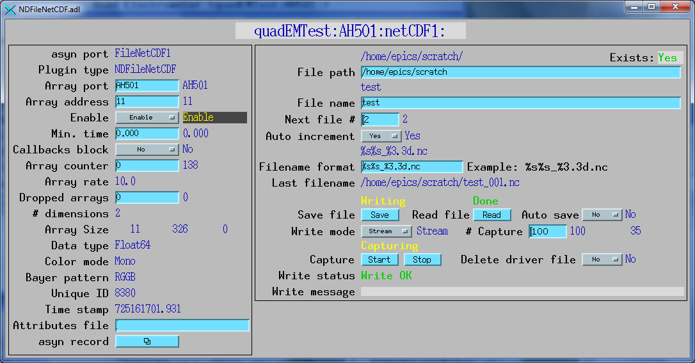
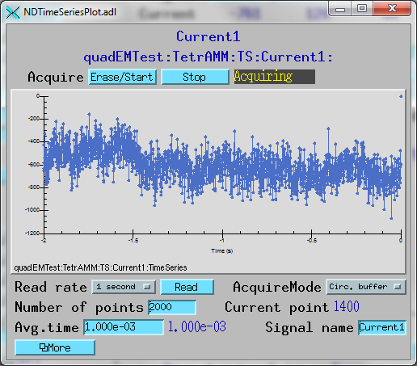
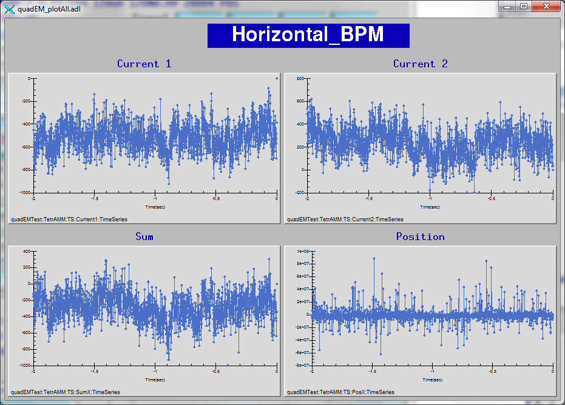
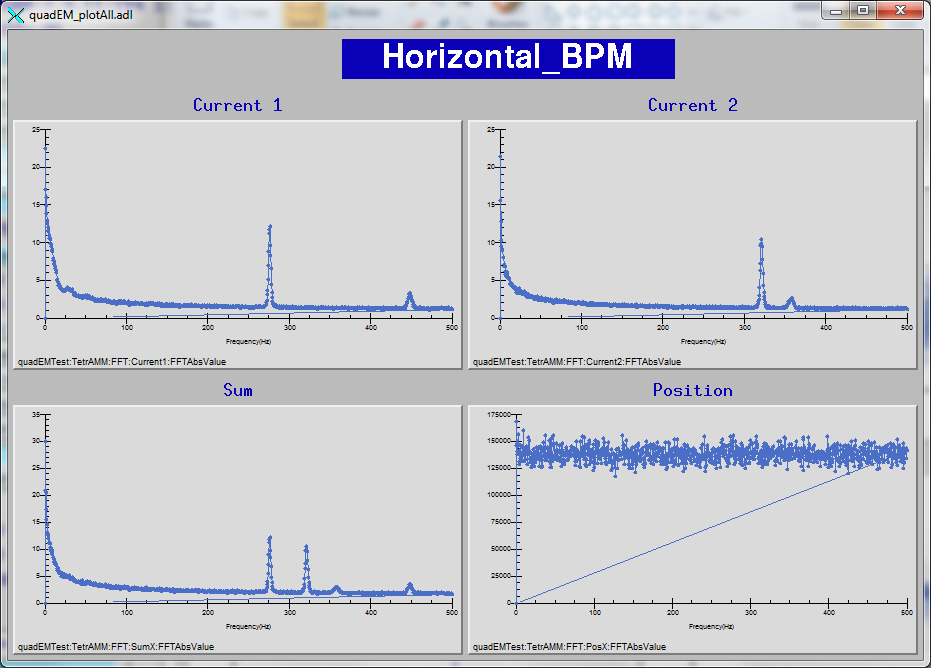
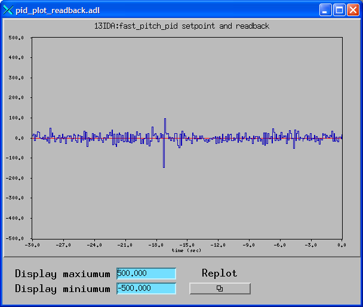

Databases
---------

quadEM.template
~~~~~~~~~~~~~~~
  
The quadEM.template database provides control of the electrometer using the standard
asyn device support. <a href="https://cars.uchicago.edu/software/epics/NDPluginStats.html">
NDStats.template</a> from <a href="https://cars.uchicago.edu/software/epics/areaDetector.html">
areaDetector</a> provides digitally averaged readings of the current, sum, difference
and position with user-defined averaging time. It also provides the standard deviation,
minimum, maximum, and other statistics, including a histogram of array values.

.. |br| raw:: html

     

.. cssclass:: table-bordered table-striped table-hover
.. list-table::
  :header-rows: 1
  :widths: auto

  * - drvInfo string
    - EPICS record name
    - EPICS record type
    - asyn interface
    - Access
    - Models supported
    - Description
  * - QE_MODEL
    - $(P)$(R)Model
    - mbbi
    - asynInt32
    - r/o
    - All
    - The model of the electrometer. This is normally determined automatically by the
      driver by reading the firmware version. It can also be specified in the configuration
      command. Values are:

      - 0: Unknown
      - 1: APS_EM
      - 2: AH401B
      - 3: AH401D
      - 4: AH501
      - 5: AH501BE
      - 6: AH501C
      - 7: AH501D
      - 8: TetrAMM
      - 9: NSLS_EM
      - 10: NSLS2_EM
      - 11: NSLS2_IC
      - 12: PCR4

  * - QE_FIRMWARE
    - $(P)$(R)Firmware
    - waveform
    - asynOctet
    - r/o
    - All
    - The firmware version of the electrometer. In R6-0 this was changed from a stringin
      record to a waveform record of length 256 because the TetrAMM firmware string is
      longer than 40 characters.
  * - QE_ACQUIRE_MODE
    - $(P)$(R)AcquireMode, $(P)$(R)AcquireMode_RBV
    - bo, bi
    - asynInt32
    - r/w
    - All
    - Acquire mode. Values are:

      - 0: "Continuous" Acquires data continuously until Acquire is set back to 0.
      - 1: "Multiple" Acquires NumAcquire acquisitions and then automatically stops acquisition,
        setting Acquire back to 0.
      - 2: "Single" Acquires a single acquisition. This is a convenience, it is identical
        to Multiple with NumAcquire=1.

      Multiple and Single mode are typically used for data acquisition.
  * - QE_ACQUIRE
    - $(P)$(R)Acquire
    - busy
    - asynInt32
    - r/w
    - All
    - Acquire command. This command turns acquisition from the device on (1) and off (0)
      Since it is a "busy" record the device can be used for step-scanning with the sscan
      record when AcquireMode=Single, **Important note:** Operation in Single mode with the sscan record also requires
      that the statistics plugins be set to have CallbacksBlock=Yes so that the driver
      waits for the statistics plugins to compute before it sets Acquire back to 0.
  * - QE_READ_FORMAT
    - $(P)$(R)ReadFormat, $(P)$(R)ReadFormat_RBV
    - bo, bi
    - asynInt32
    - r/w
    - All except APS_EM, NSLS_EM, NSLS2_EM, and PCR4
    - Read format from the device. Values are:

      - 0: Binary 
      - 1: ASCII 

      In binary mode the AH401 and AH501 send integer data with no delimiters or terminators.
      This can lead to problems if the data stream is somehow corrupted because there
      is no way to know where one set of readings end and the next set begins. This should
      not happen under normal conditions because the devices use TCP, which guarantees
      retransmission of dropped packets. However, it has been observed to occur. In binary
      mode the TetrAMM sends IEEE 754 double-precision values for each channel, followed
      by a Signalling NaN. The NaN is thus effectively a terminator that can be used to
      synchronize the data stream if it is somehow corrupted. ASCII mode is robust against
      the synchronization problem, since each reading ends with terminator characters.
      However, ASCII mode is generally slower. On the AH401 ASCII mode appears to be able
      to do 500 reading/s, which is sufficient except for the case when IntegrationTime=.001
      and PingPong=Yes. On the AH501 ASCII mode ranges from 7 to 10 times slower than
      binary mode. On the TetrAMM ASCII mode requires a minimum value of ValuesPerRead
      of 500, which limits the update rate to 200 Hz. In binary mode the minimum value
      of ValuesPerRead is 5, which is an update date of 20 kHz, or 100 times faster than
      ASCII mode.
  * - QE_RANGE
    - $(P)$(R)Range, $(P)$(R)Range_RBV
    - mbbo, mbbi
    - asynInt32
    - r/w
    - All
    - Range command. This selects the sensitivity of the electrometer (A/D units per nanoamp). |br|
      For the TetrAMM the choices are:

      - ±120uA
      - ±120nA
      
      For the AH501 series the choices are:

      - ±2.5mA
      - ±2.5uA
      - ±2.5nA

      For the AH401 series this selects the feedback capacitor, which controls the gain
      of the device. There are 8 capacitor choices in units of saturation charge:
      
      - 1800 pC
      - 350 pC
      - 300 pC
      - 250 pC
      - 200 pC
      - 150 pC
      - 100 pC
      - 50 pC
 
      For the NSLS_EM this selects the feedback capacitor, which controls the gain of
      the device. There are 8 capacitor choices in units of saturation charge:

      - 350 pC
      - 300 pC
      - 250 pC
      - 200 pC
      - 150 pC
      - 100 pC
      - 50 pC
      - 12 pC

      For the NSLS2_EM this there are 5 ranges:

      - 1 uA
      - 10 uA
      - 100 uA
      - 1000 uA
      - 5000 uA
      
      For the PCR4 v1 there is 1 range:
      
      - 50 uA

      For the PCR4 v2 there are 4 ranges:

      - 50 mA
      - 250 uA
      - 2.5 uA
      - 25 nA
      
      For the APS_EM this selects the feedback capacitor, which controls the gain of the
      device. There are 8 capacitor choices:
      
      - External
      - 17.6 pf
      - 8.80 pF
      - 5.87 pF
      - 4.40 pF
      - 3.52 pF
      - 2.93 pF
      - 2.51 pF 
      
      On the APS_EM all gains except the first External gain use capacitors that are built
      in to the Burr Brown chip. These are quite small capacitors and only cover a narrow
      range, so the gains are quite high, and only rather low currents can be measured
      with them, even at the shortest integration times. The external capacitors can be
      replaced to select the first gain, and boards are normally built with 220 pF external
      capacitors. At APS 13-ID we have used much larger values, 1000 to 5000 pF, because
      the currents from our undulator beam position monitor are large. There are actually
      8 external capacitors: 4 of them control the gain for each input for the "ping"
      channel, and the other 4 control the gain for the "pong" channel. By using one capacitor
      value for the 4 diodes on the ping channel and a different capacitor value for the
      4 diodes on the pong channel, then two user-selectable gains are available. One
      must then select the appropriate channel in the PingPong record, and not use the
      average.
  * - QE_PING_PONG
    - $(P)$(R)PingPong, $(P)$(R)PingPong_RBV
    - mbbo, mbbi
    - asynInt32
    - r/w
    - AH401 series, NSLS_EM, APS_EM
    - The AH401 series, NSLS_EM, and the APS_EM have 2 input channels, which we call Ping
      and Pong here. This doubles the speed of the unit, because one channel is being
      digitized while the other is integrating. This record selects how the two channels
      are treated., On the AH401 series the choices are "Off" (0) and "On" (1). "Off" only returns the
      data from the Ping channel. This reduces noise because only a single integration
      capacitor is used, but it reduces the data rate by a factor of two, because data
      are only returned on every other integration time. "On" returns the data from both
      channels, which doubles the data rate at some expense in noise., On the NSLS_EM the choices are "Phase0" (0), "Phase1" (1), and "Both (2). "Phase0"
      only returns the data from the Phase0 channel, Phase1 from the Phase1 channel, and
      Both from both Phase0 and Phase1. The device can only return Phase0 and Phase1 correctly
      when ValuesPerRead=1. The driver automatically sets PingPong=Both if ValuesPerRead
      is not 1., On the APS_EM both values are always transmitted from the device. The choices are
      #1 (Ping), #2 (Pong), and Avg. which averages the values from the Ping and Pong
      channels. Note that if Range=External and the two external capacitors are different,
      then one should not use Avg. because that will mix data from two different gains.
  * - QE_INTEGRATION_TIME
    - $(P)$(R)IntegrationTime, $(P)$(R)IntegrationTime_RBV
    - ao, ai
    - asynFloat64
    - r/w
    - AH401 series, NSLS_EM, APS_EM
    - Selects the integration time of the amplifier. As the integration time is increased
      the sensitivity increases, but the number of readings/sec sent from the device is
      decreased., For the AH401 series values range from 0.001s to 1.000s. The data are sent after
      one integration time if PingPong="On" or after 2 integration times if PingPong="Off"., For the NSLS_EM the values range from .0004s to 1.0 s. Both the Phase0 (Ping) and
      Phase1 (Pong) values are sent at after a time period equal to IntegrationTime *
      ValuesPerRead., For the APS_EM the values range from .000615s to 0.1311s. The data are sent to the
      VME card from the amplifier after 2 integration times, one value in the Ping channel
      and one value in the Pong channel. The data period is thus 0.00123 to 0.02622 s,
      or a frequency range of about 813 Hz to 38.1 Hz.
  * - QE_NUM_CHANNELS
    - $(P)$(R)NumChannels, $(P)$(R)NumChannels_RBV
    - mbbo, mbbi
    - asynInt32
    - r/w
    - TetrAMM and AH501 series
    - Selects the number of channels to measure and transmit data for. Using fewer than
      4 channels increases the sampling rate. Allowed choices are:

      - 1: channel 1 only
      - 2: channels 1 and 2 only
      - 4: channels 1-4

  * - QE_GEOMETRY
    - $(P)$(R)Geometry, $(P)$(R)Geometry_RBV
    - mbbo, mbbi
    - asynInt32
    - r/w
    - All
    - Selects the geometry of the current inputs as discussed above. Allowed choices are:

      - 0: Diamond
      - 1: Square
 
  * - QE_RESOLUTION
    - $(P)$(R)Resolution, $(P)$(R)Resolution_RBV
    - mbbo, mbbi
    - asynInt32
    - r/w
    - AH501 series
    - Selects the resolution of the ADC in bits. Using 16-bits increases the sampling
      rate by a factor of 2 relative to 24-bits. Allowed choices are:

      - 16: 16-bit data
      - 24: 24-bit data
      
  * - QE_BIAS_STATE
    - $(P)$(R)BiasState, $(P)$(R)BiasState_RBV
    - bo, bi
    - asynInt32
    - r/w
    - TetrAMM, AH501C, AH501D, and PCR4
    - Selects the state of the bias supply output voltage. Allowed choices are:

      - 0: Off
      - 1: On

  * - QE_HVS_READBACK
    - $(P)$(R)HVSReadback
    - bi
    - asynInt32
    - r/o
    - TetrAMM
    - Readback of the actual status of the bias supply output. Possible values are:

      - 0: Off
      - 1: On

      This will stay On for a few seconds after setting BiasState to Off, while the voltage
      is ramped down to 0.
  * - QE_BIAS_INTERLOCK
    - $(P)$(R)BiasInterlock, $(P)$(R)BiasInterlock_RBV
    - bo, bi
    - asynInt32
    - r/w
    - TetrAMM
    - Selects the state of the bias supply interlock. Allowed choices are:

      - 0: Off
      - 1: On

  * - QE_BIAS_VOLTAGE
    - $(P)$(R)BiasVoltage, $(P)$(R)BiasVoltage_RBV
    - ao, ai
    - asynFloat64
    - r/w
    - TetrAMM, AH501C, AH501D, NSLS2_EM, and PCR4
    - Controls the voltage of the bias supply output.
  * - QE_HVV_READBACK
    - $(P)$(R)HVVReadback
    - ai
    - asynFloat64
    - r/o
    - TetrAMM
    - Readback of the actual voltage of the bias supply output.
  * - QE_HVI_READBACK
    - $(P)$(R)HVIReadback
    - ai
    - asynFloat64
    - r/o
    - TetrAMM
    - Readback of the actual current in microamps of the bias supply output.
  * - QE_VALUES_PER_READ
    - $(P)$(R)ValuesPerRead, $(P)$(R)ValuesPerRead_RBV
    - longout, longin
    - asynInt32
    - r/w
    - All
    - On the TetrAMM this record controls the number of readings that are averaged in
      the TetrAMM using the NRSAMP command. The TetrAMM always digitizes at 100 kHz (10
      microseconds per sample). The minimum value of NRSAMP (and hence ValuesPerRead)
      in Binary mode is 5, which means the maximum number of values per second is 20000.
      Setting ValuesPerRead to 100, for example, will average 100 readings in the TetrAMM,
      and thus result in a 1000 values per second sent from the TetrAMM to EPICS., , On the NSLS_EM and NSLS2_EM this record controls the number of readings that are
      summed in the hardware., For all other models ValuesPerRead controls the number of values that are read from
      the meter in a single call. These values are averaged in the driver before it does
      any callbacks. The default is 1 (no averaging). |br|
      Increasing ValuesPerRead will reduce the CPU time because:
      
      - On the TetrAMM it reduces the number of readings per second sent, from the maximum
        of 20000, to 100000/ValuesPerRead.
      - On the NSLS_EM it reduces the number of readings per second sent, from the maximum
        of 2500 (depending on IntegrationTime, to a maximum of 2500/ValuesPerRead.
      - On the NSLS2_EM it reduces the number of readings per second sent, from the maximum
        of 10000 (depending on internal setting of ADC rate)to 10000/ValuesPerRead.
      - On the AH401 and AH501 series the driver reduces the frequency of asynOctet-&gt;read()
        calls by a factor of ValuesPerRead, because it can obtain multiple readings from
        the meter in a single call. This is particularly significant on the AH501 series,
        which can transmit up to 26,040 readings per second.
      - It reduces the frequency of callbacks to device support.
      
      The potential disadvantages of larger values for ValuesPerRead are:

      - It will change the statistics computed by the NDPluginStats plugin because an
        initial averaging operation has already been performed, which reduces the standard
      - deviation, changes the histogram, etc.
      - On the NSLS_EM it prevents selecting only Phase0 or Phase1 with the PingPong record.
      - It will reduce the sampling frequency of the TimeSeries support
      - It will reduce the update frequency of the EPID fast feedback support.

  * - QE_SAMPLE_TIME
    - $(P)$(R)SampleTime_RBV
    - ai
    - asynFloat64
    - r/o
    - All
    - Provides the actual time between sample readings from the device. This is controlled
      by the following parameters:

      - ValuesPerRead: All models
      - IntegrationTime: AH401 series, NSLS_EM, and APS_EM
      - PingPong: AH401 series and NSLS_EM
      - NumChannels: AH501 series
      - Resolution: AH501 series
      
      The sample time on the TetrAMM is controlled by the following equation:

      - 10 microseconds * ValuesPerRead.

      The sample time on the AH501 series is controlled by the following algorithm:

      - SampleTime = 38.4 microseconds * NumChannels * ValuesPerRead

      If Resolution == 24 then SampleTime = SampleTime * 2 |br|
      The minimum sample time (NumChannels=1, ValuesPerRead=1, Resolution=16) is 38.4
      microseconds, or a sampling frequency of 26.04 kHz. The maximum sample time with
      ValuesPerRead=1, NumChannels=4, Resolution=24 is 307.2 microseconds, or a sampling
      frequency of 3.255 kHz. Setting ValuesPerRead &gt; 1 will increase the sample time
      and reduce the sampling frequency proportionally. |br| 
      The sample time on the AH401 series is controlled by the following algorithm:

      - SampleTime = IntegrationTime * ValuesPerRead

      If PingPong == 0 then SampleTime = SampleTime * 2 |br|
      The minimum sample time is 0.001 seconds, or 1 kHz sampling frequency. The maximum
      sampling time (PingPong=0) is 2 seconds, or 0.5 Hz sampling frequency. Setting ValuesPerRead
      &gt; 1 will increase the sample time and reduce the sampling frequency proportionally., , 
      The sample time on the NSLS_EM is controlled by the following algorithm:

      - SampleTime = IntegrationTime * ValuesPerRead

      If PingPong != Both then SampleTime = SampleTime * 2 |br|
      The minimum sample time is 0.00041 seconds, or 2.5 kHz sampling frequency. The maximum
      sampling time (PingPong!=Both) is 2 seconds, or 0.5 Hz sampling frequency. Setting
      ValuesPerRead &gt; 1 will increase the sample time and reduce the sampling frequency
      proportionally. |br|
      For the APS_EM the sample time is controlled only by ValuesPerRead and the IntegrationTime.
      For ValuesPerRead=1 it ranges from 0.00123 to 0.02622 s, or a sampling frequency
      range of about 813 Hz to 38.1 Hz. Setting ValuesPerRead &gt; 1 will increase the
      sample time and reduce the sampling frequency proportionally.
  * - QE_AVERAGING_TIME
    - $(P)$(R)AveragingTime, $(P)$(R)AveragingTime_RBV
    - ao, ai
    - asynFloat64
    - r/w
    - All
    - Controls the time period over which values are accumulated in the ring buffer before
      they are read out into NDArray objects and any registered plugins are called. AveragingTime
      is actually used to compute NumAverage_RBV=AveragingTime/SampleTime_RBV. The callbacks
      are done when the number of values in the ring buffer equals NumAverage_RBV, and
      exactly NumAverage_RBV values will be passed to the plugins., However, setting AveragingTime=0 will set NumAverage_RBV=0 as well, and will disable
      automatic callbacks to areaDetector plugins. In this case data will only be read
      from the ring buffer when the ReadData record is processed. This will read out all
      available data from ring buffer, and the actual number of values read will be NumAveraged_RBV.
      This mode could be useful when the quadEM is being used for data acquisition, for
      example in a scan. In this case processing the ReadData record will read all values
      that have accumulated in the ring buffer since ReadData was last processed. ReadData
      must be processed frequently enough to avoid ring-buffer overflow., On the TetrAMM in External Bulb mode and on the AH501BE in External Gate mode AveragingTime
      should be set to 0. The driver will force the averaging to occur each time it detects
      the falling edge of the gate pulse. This means that it will use the readings that
      happened while the gate pulse was high.
  * - QE_NUM_AVERAGE
    - $(P)$(R)NumAverage_RBV
    - longin
    - asynInt32
    - r/o
    - All
    - Provides the number of values that will be accumulated in the ring buffer before
      they are read out into NDArray objects and any registered plugins are called. NumAverage_RBV
      is computed as (int)((AveragingTime / SampleTime_RBV) + 0.5).
      , On the TetrAMM when TriggerMode=External Bulb and on the AH501BE when TriggerMode=External
      Gate the AveragingTime is ignored and NumAverage_RBV will be 0. The averaging is
      done on all samples collected when the external gate signal is asserted.
  * - QE_NUM_AVERAGED
    - $(P)$(R)NumAveraged_RBV
    - longin
    - asynInt32
    - r/o
    - All
    - Provides the number of values that were actually accumulated in the ring buffer
      before they were read out into NDArray objects and any registered plugins were called.
      If AveragingTime&gt;0 then NumAveraged_RBV will be the same as NumAverage_RBV. However,
      if AveragingTime=0. then NumAverage_RBV=0 and NumAveraged_RBV gives the actual number
      of values read from the ring buffer when the ReadData record was processed. This
      is also true on the TetrAMM when TriggerMode=ExternalBulb.
  * - N.A.
    - $(P)$(R)FastAveragingTime, $(P)$(R)FastAveragingTime_RBV
    - ao, ai
    - asynFloat64
    - r/w
    - All
    - Controls the time period over which values are averaged with the "fast averaging"
      support when FastAverageScan.SCAN=I/O Intr. This value is converted to NumFastAverage,
      which is then written to the .SVAL field of each ai record.
  * - N.A.
    - $(P)$(R)NumFastAverage
    - longin
    - asynInt32
    - r/o
    - All
    - Provides the number of values that will be averaged in the "fast averaging" support.
      NumFastAverage is computed as (int)((FastAveragingTime / SampleTime_RBV) + 0.5).
  * - QE_NUM_ACQUIRE
    - $(P)$(R)NumAcquire
      , $(P)$(R)NumAcquire_RBV
    - longout
      , longin
    - asynInt32
    - r/w
    - All
    - The number of acquisitions to acquire when AcquireMode=Multiple. An acquisition
      is complete when the callbacks are called. This normally occurs when the AveragingTime
      has elapsed. However when TriggerMode=Ext. Bulb then the callbacks are called and
      an acquisition is complete on the trailing edge of each external gate pulse.
  * - QE_NUM_ACQUIRED
    - $(P)$(R)NumAcquired
    - longin
    - asynInt32
    - r/o
    - All
    - The number of acquisitions completed since Acquire was set to 1.
  * - QE_READ_DATA
    - $(P)$(R)ReadData
    - busy
    - asynInt32
    - r/o
    - All
    - Writing 1 to this record reads all data from the ring buffer and does the NDArray
      callbacks to all registered plugins. This is typically done when the quadEM is being
      used for data acquisition, for example in a scan. In this case AveragingTime is
      set to 0 and processing the ReadData record will read all values that have accumulated
      in the ring buffer since ReadData was last processed.
  * - QE_RING_OVERFLOWS
    - $(P)$(R)RingOverflows
    - longin
    - asynInt32
    - r/o
    - All
    - It is possible for the ring buffer to overflow. The rate at which values are added
      to the ring buffer is controlled by SampleTime_RBV. The rate at which values are
      removed is determined by AveragingTime, or by the rate at which ReadData is processed
      if AveragingTime=0. The size of the ring buffer is determined by the ringBufferSize
      argument to the driver constructor. This defaults to 2048 if it is not specified
      in configuration command in the startup script. If the ring buffer is full when
      the driver tries to add a new value, then the oldest value in the buffer is discarded,
      the new value is added, and RingOverflows is incremented. RingOverflows is set to
      0 the next time the ring buffer is read out.
  * - QE_TRIGGER_MODE
    - $(P)$(R)TriggerMode
    - mbbo
    - asynInt32
    - r/w
    - TetrAMM, AH501, AH401, and PCR4
    - Allowed choices are:

      - 0: "Free Run" (all models). Ignores any external gate or trigger signal.
      - 1: "Software" (possible future choice for TetrAMM) This will trigger a single
        acquisition each time a software trigger command is sent.
      - 2: "Ext. Trigger" (AH401B, TetrAMM, PCR4) This is an edge-sensitive trigger. On the
        TetrAMM this will collect samples for the AveragingTime and then wait for the next
        trigger.
      - 3: "Ext. Bulb" (AH501D, TetrAMM) This is a level-sensitive trigger. It acquires
        data while the external gate signal is asserted. On the trailing edge of the gate
        signal the callbacks will be called. In this mode the AveragingTime is ignored and
        the averaging is done for all samples received between the leading and trailing
        edge of a single gate pulse.
      - 4: "Ext. Gate" (TetrAMM) This is a level sensitive gate. It acquires data while
        the external gate signal is asserted. However, unlike Ext. Bulb the trailing edge
        of the gate signal is ignored, and the averaging is done for NumAverage_RBV samples
        as with Free Run mode. The difference is that the actual averaging time will be
        longer than AveragingTime, and is controlled by the duty cycle of the external gate
        pulse. If the external gate pulse is asserted 40% of the time, then the actual averaging
        time will be AveragingTime * 2.5
  * - QE_TRIGGER_POLARITY
    - $(P)$(R)TriggerPolarity
    - mbbo
    - asynInt32
    - r/w
    - PCR4
    - 0=Positive, 1=Negative.
  * - QE_RESET
    - $(P)$(R)Reset
    - bo
    - asynInt32
    - r/w
    - All
    - Reset command. Processing this record will reset the electrometer. On the APS_EM
      this operation takes about 1 second, and may be required to establish communication
      if the amplifier unit is power-cycled or disconnected and reconnected. On the TetrAMM
      this does a hardware reset of the device, which takes about 10 seconds. On all models
      this operation downloads all of the EPICS settings to the electrometer. The Reset
      reord must be processed if any electrometer is power-cycled without rebooting the
      EPICS IOC.
  * - QE_CURRENT_NAME
    - $(P)$(R)CurrentName[1-4]
    - stringin
    - N.A.
    - r/w
    - All
    - User-defined name to give each of the Current[1-4] inputs.
  * - N.A.
    - $(P)$(R)Current[1-4]Ave
    - ai
    - asynFloat64 (addr=0-3)
    - r/o
    - All
    - Average current computed by the fast averaging support.
  * - N.A.
    - $(P)$(R)Sum[X,Y,All]Ave
    - ai
    - asynFloat64 (addr=4-6)
    - r/o
    - All
    - Average sum (X, Y, All) computed by the fast averaging support.
  * - N.A.
    - $(P)$(R)Diff[X,Y]Ave
    - ai
    - asynFloat64 (addr=7-8)
    - r/o
    - All
    - Average difference (X, Y) computed by the fast averaging support.
  * - N.A.
    - $(P)$(R)Position[X,Y]Ave
    - ai
    - asynFloat64 (addr=9-10)
    - r/o
    - All
    - Average position (X, Y) computed by the fast averaging support.
  * - QE_CURRENT_OFFSET
    - $(P)$(R)CurrentOffset[1-4]
    - ao
    - asynFloat64 (addr=0-3)
    - r/w
    - All
    - Offset that will be subtracted from each reading when calculating the Current[1-4].
      The current is calculated as Current = Raw*CurrentScale - CurrentOffset, where Raw
      is the raw value from the device.
  * - N.A.
    - $(P)$(R)ComputeCurrentOffset[1-4]
    - calcout
    - N.A.
    - r/w
    - All
    - Processing this record will compute a new value of CurrentOffset that will set value
      of the current to 0 under the current conditions. It computes CurrentOffset(new)
      = Current[1-3]:MeanValue_RBV + CurrentOffset(old). This record is provided to convenience
      set the CurrentOffset when the input signal is 0.
  * - QE_CURRENT_SCALE
    - $(P)$(R)CurrentScale[1-4]
    - ao
    - asynFloat64 (addr=0-3)
    - r/w
    - All
    - Scale factor that each reading is multiplied by when calculating the Current[1-4].
      The current is calculated as Current = Raw*CurrentScale - CurrentOffset, where Raw
      is the raw value from the device. This record provides a way to convert the current
      readings into engineering units. All of the models except the TetrAMM transmit integer
      data. This is converted to double precision float for averaging and statistics.
      It is converted back to integer for the time series software, which requires integer
      data. The TetrAMM transmits double precision data in units of amps, so the values
      are typically between 1e-4 to 1e-12. It is convenient to use a CurrentScale of 1e9
      or 1e12, for example, so that the data are displayed in units of nano-amps or pico-amps.
      They are then reasonable sized integers, and the time series software can be used.
  * - N.A.
    - $(P)$(R)CurrentPrec[1-4]
    - mbbo
    - N.A.
    - r/w
    - All
    - Precision (# digits) to use to display the current for this channel. Choices are
      0-9. CurrentPrec1 also controls SumX and DiffX. CurrentPrec3 also controls SumY
      and DiffY. CurrentPrec2 also controls SumAll. Note that when using medm and other
      display clients it is necessary to close and re-open the quadEM screen for the displayed
      precision to be changed. This is a limitation of the Channel Access protocol which
      does not send monitor events when the precision is changed.
  * - QE_POSITION_OFFSET
    - $(P)$(R)PositionOffset[X,Y]
    - ao
    - asynFloat64 (addr=0-1)
    - r/w
    - All
    - Offset that will be subtracted from each reading when calculating the Position[X,Y].
      The position is calculated as Position = Diff/Sum * PositionScale - PositionOffset.
  * - N.A.
    - $(P)$(R)ComputePosOffset[X,Y]
    - calcout
    - N.A.
    - r/w
    - All
    - Processing this record will compute a new value of PositionOffset that will set
      value of the position to 0 under the current conditions. It computes PositionOffset(new)
      = Pos[X,Y]:MeanValue_RBV + PositionOffset(old). This record is provided to convenience
      set the PositionOffset when the position should be defined as 0.
  * - QE_POSITION_SCALE
    - $(P)$(R)PositionScale[X,Y]
    - ao
    - asynFloat64 (addr=0-1)
    - r/w
    - All
    - Scale that will be used when calculating the Position[X,Y]. The position is calculated
      as Position = Diff/Sum * PositionScale - PositionOffset.
  * - N.A.
    - $(P)$(R)PositionPrec[X,Y]
    - mbbo
    - N.A.
    - r/w
    - All
    - Precision (# digits) to use to display the position in X or Y. Choices are 0-9.
  * - QE_CALIBRATION_MODE
    - $(P)$(R)CalibrationMode
    - bo
    - asynInt32
    - r/w
    - NSLS2_EM
    - Puts driver in calibration mode where ADC offsets can be computed. Choices are Off
      (0) and On (1). The Calibration mode is used to compute the ADC offsets.
  * - N.A.
    - $(P)$(R)ADCOffset[1-4]
    - longout
    - N.A.
    - r/w
    - NSLS2_EM
    - ADC offset for this channel.
  * - N.A.
    - $(P)$(R)CopyADCOffsets
    - transform
    - N.A.
    - r/w
    - NSLS2_EM
    - Processing this record will copy the current reading from each channel into the
      ADCOffset[1-4] records. This should only be done when CalibrationMode=On. This does
      an ADC offset calibration that is independent of the Range of the device.
 
TetrAMM Acquisition Modes
~~~~~~~~~~~~~~~~~~~~~~~~~
  
The TetrAMM can be used in 8 different acquisition modes, depending on the values
of the TriggerMode and AcquireMode records. The following table describes these
modes. Note that AcquireMode=Single is completely equivalent to AcquireMode=Multiple
and NumAcquire=1, so the table does not list AcquireMode=Single.

.. cssclass:: table-bordered table-striped table-hover
.. list-table::
  :header-rows: 1
  :widths: auto

  * - TriggerMode
    - AcquireMode
    - Description
    - TetrAMM commands
  * - Free Run
    - Continuous
    - Values are acquired continuously and are averaged each time the AveragingTime is reached.
    - NRSAMP=ValuesPerRead, NAQ=0, TRG:OFF
  * - Free Run
    - Multiple
    - Data is acquired for the AveragingTime. This is repeated NumAcquire times and then
      acquisition stops. The plugins will be called NumAcquire times, each time with NumAverage
      samples.
    - NRSAMP=ValuesPerRead, NAQ=0, TRG:OFF
  * - Ext. Trig.
    - Continuous
    - A fixed number of samples is acquired starting on each rising edge of the external
      trigger input. AveragingTime must be set to a value less than the time between trigger
      pulses.
    - NRSAMP=ValuesPerRead, NAQ=AveragingTime/1e5/ValuesPerRead, TRG:ON
  * - Ext. Trig.
    - Multiple
    - A fixed number of samples is acquired starting on the first rising edge of the external
      trigger input. This repeats NumAcquire times and then acquisition stops. ValuesPerRead
      must be set to a value less than AveragingTime/1e5.
    - NRSAMP=ValuesPerRead, NAQ=AveragingTime*1e5/ValuesPerRead, TRG:ON
  * - Ext. Bulb
    - Continuous
    - Samples are acquired while the external trigger input is asserted. On each trailing
      edge of the external trigger signal the plugins are called. ValuesPerRead must be
      set to a value less than (external trigger asserted time * 1e5). AveragingTime is
      ignored in this mode.
    - NRSAMP=ValuesPerRead, NAQ=0, TRG:ON
  * - Ext. Bulb
    - Multiple
    - Samples are acquired while the external trigger input is asserted. On each trailing
      edge of the external trigger signal the plugins are called. This is repeated NumAcquire
      times and then acquisition is stopped. ValuesPerRead must be set to a value less
      than (external trigger asserted time * 1e5). AveragingTime is ignored in this mode.
    - NRSAMP=ValuesPerRead, NAQ=0, TRG:ON
  * - Ext. Gate
    - Continuous
    - Samples are acquired while the external trigger input is asserted. When NumAverage
      samples have been acquired the plugins are called. The actual averaging time between
      calling the plugins will be longer than AverageTime, and is controlled by the duty
      cycle of the external gate signal. The trailing edge of the gate pulse is ignored
      in this mode. ValuesPerRead must be set to a value less than (external trigger asserted
      time * 1e5).
    - NRSAMP=ValuesPerRead, NAQ=0, TRG:ON
  * - Ext. Gate
    - Multiple
    - Samples are acquired while the external trigger input is asserted. When NumAverage
      samples have been acquired the plugins are called. The actual averaging time between
      calling the plugins will be longer than AverageTime, and is controlled by the duty
      cycle of the external gate signal. When the plugins have been called NumAcquire
      times then acquisition is stopped. Note that the actual number of gate pulses received
      will be &gt; NumAcquire, and is also controlled by the duty cycle of the external
      gate signal. The trailing edge of the gate pulse is ignored in this mode. ValuesPerRead
      must be set to a value less than (external trigger asserted time * 1e5).
    -  NRSAMP=ValuesPerRead, NAQ=0, TRG:ON

The following is the medm screen to control the quadEM with the records in quadEM.template.

.. figure:: quadEM.png
    :align: center

Plugins
~~~~~~~
  
The example IOCs provided with quadEM load a file called commonPlugins.cmd, which
loads the following set of plugins from the areaDetector module. For more information
see the documentation in the links in the table below. Other plugins can also be
loaded, for example the TIFF, HDF5 or Nexus file writing plugins, etc.

.. cssclass:: table-bordered table-striped table-hover
.. list-table::
  :header-rows: 1
  :widths: auto

  * - Plugin type
    - Record prefixes
    - Description
        
  * - NDPluginStats
    - $(P)$(R)Current[1-4]:
    - Statistics for the current values. The average value is $(P)$(R)Current[1-4]:MeanValue_RBV.
      Many other statistics are available, including the minimum, maximum, standard deviation,
      and histogram of values.
  * - NDPluginStats
    - $(P)$(R)Sum[X,Y,All]:
    - Statistics for the sum of currents 1+2, 3+4, and 1+2+3+4. The average value is $(P)$(R)Sum[X,Y,All]:MeanValue_RBV.
      Many other statistics are available, including the minimum, maximum, standard deviation,
      and histogram of values.
  * - NDPluginStats
    - $(P)$(R)Diff[X,Y]:
    - Statistics for the differences of current 2-1 and 4-3. The average value is $(P)$(R)Diff[X,Y]:MeanValue_RBV.
      Many other statistics are available, including the minimum, maximum, standard deviation,
      and histogram of values.
  * - NDPluginStats
    - $(P)$(R)Pos[X,Y]:
    - Statistics for the positions. The average value is $(P)$(R)Pos[X,Y]:MeanValue_RBV.
      Many other statistics are available, including the minimum, maximum, standard deviation,
      and histogram of values.
  * - NDPluginStdArrays
    - $(P)$(R)image1:
    - Plugin that receives NDArray callbacks of dimension [11,NumAveraged_RBV] and puts
      this data into an EPICS waveform record. This can be used to provide access to all
      of the data from quadEM to any Channel Access client.
  * - NDFileNetCDF
    - $(P)$(R)netCDF1:
    - Plugin that receives NDArray callbacks of dimension [11,NumAveraged_RBV] and writes
      this data into a netCDF file. This can be done in Single mode, writing one array
      per file. o It can also be done in Stream mode, which continuously appends arrays
      to a single netCDF file.
  * - NDPluginTimeSeries
    - $(P)$(R)TS:
    - Plugin that receives NDArray callbacks of dimension [11,NumAveraged_RBV] and forms
      11 different time-series arrays. This plugin provides a time-history (like a digital
      scope) of the current, sum, difference and position at speeds up to 20000Hz (TetrAMM),
      6510 Hz (AH501 series), 1000Hz (AH401 series) or 813 Hz (APS_EM). The time per point
      can be greater than the sampling time, in which case it does averaging. The time
      series can operate in a fixed-length mode where acquisition stops after the specified
      number of time points have been collected. This mode is suited for data-acquisition
      applications, such as on-the-fly scanning. The time series plugin can also operate
      in a circular buffer mode with continuous acquisition and display of the most recent
  * - NDPluginFFT
    - $(P)$(R)FFT[1-11]:
    - Plugin that receives the time-series arrays from the NDPluginTimeSeries plugin and
      computes the frequency power-spectrum of each signal. This plugin can also average
      the FFTs to improve the signal/noise ratio.

Note that the first time the IOC is started all of the plugins will have EnableCallbacks=Disable.
It is necessary to enable each of the plugins that will be used. The plugins will
also initially start with CallbacksBlock=No. Setting CallbacksBlock=Yes can reduce
CPU load on slow processors like the MVME2100 (see the performance tables below).
The values of EnableCallbacks and CallbacksBlock are saved by autosave, and will
be restored the next time the IOC is started.
  
    This is the medm screen for all of the plugins defined in commonPlugins.cmd.

.. figure:: QECommonPlugins.png
    :align: center

    This is the medm screen for the Current1: NDPluginStats plugin loaded by commonPlugins.cmd.

.. figure:: QENDStats.png
    :align: center

This is the medm screen for the netCDF1: NDFileNetCDF plugin loaded by commonPlugins.cmd.

This is the medm screen to control the NDPluginTimeSeries plugin. In this example
the time per point from the TetrAMM is 50 microseconds, and averaging time for the
time series plugin is 1 millisecond, or 20 points. The plugin has 2000 time points,
and is operating in circular buffer mode.
 
.. figure:: quadEM_TimeSeries.png
    :align: center

This is a plot of the time series for Current 1. It shows the last 2 seconds of
data in circular buffer mode.

This is a plot of the time series for the horizontal currents, sum, and position.
It shows the last 2 seconds of data in circular buffer mode.

This is a plot of the FFT for Current 1. DC offset suppression is enabled and 10
FFTs are being averaged to improve the signal/noise ratio.

.. figure:: quadEM_NDFFTFreqSpectrumPlot.png
    :align: center

This is an medm screen for control of all 11 FFT plugins.

.. figure:: QEFFTPlugins.png
    :align: center

This is an medm screen that displays the FFTs of the Current, Sum, and Position
for the time-series data above. 100 FFTs are being averaged to improve the signal/noise
ratio.

fast_pid_control.db
~~~~~~~~~~~~~~~~~~~

The quadEM can be used to do fast feedback with the EPID record from the synApps
"std" module. The EPID record will process at up to the SampleTime discussed above.
The DT field of the EPID record controls the time between feedback calculations,
and this is constrained to be an integer multiple N of the quadEM SampleTime. If
N>1 then N samples are averaged for each feedback operation.
  
This is the medm screen that controls the fast feedback of the pitch of the monochromator
on APS beamline 13-ID. The readback and control PVs cannot be changed after iocInit.
The update rate (SCAN rate of EPID record) only controls the rate at which the EPID
record displays "snapshots" of the values of the input, output, and error. It does
not affect the rate at which the feedback is actually being done, which is controlled
by the DT field in the EPID record, can be much faster than the SCAN value.

.. figure:: quadEM_pid_control.png
    :align: center
  
This is the medm screen that controls the PID parameters. These include the feedback
coefficients KP, KI, and KD. The DT (delta time) field controls the rate at which
the feedback is actually been run. In this case DT=68.0 ms, which is 55 times longer
than the sampling time (1.23 ms), so 55 position readings are being averaged each
time the feedback is run.

.. figure:: quadEM_pid_parameters.png
    :align: center
  
This is an medm screen that displays the setpoint of the pitch of the monochromator
(in red), and the actual readback from the quadEM (in blue). Note that the readback
here is only the snapshot values from the EPID record. For full-speed readings of
the readback the waveform records from the quadEM_TimeSeries.template database would
be used.

  
This is pid_fast.template, an example substitutions file. This example uses a quadEM
asyn port driver named "APS_EM". ICHAN is set to read from addr=9 and 10, which
are the two position values of the quadEM driver. The INPUT_DATA and INPUT_INTERVAL
strings are the drvInfo strings for these parameters in the driver. The output is
sent to an asyn port driver named DAC1, which is a dac128V 12-bit A/D converter
in this data. OCHAN is set to write to addr=1 and 2, which are the second and third
DAC channels on that card. The OUTPUT_DATA string is the drvInfo string for the
double precision data in the dac128V.
  
::

  file "$(STD)/stdApp/Db/fast_pid_control.db"
  {
  pattern
  {P,                 PID,  INPUT,     INPUT_DATA,   INPUT_INTERVAL, ICHAN, OUTPUT, OCHAN,  OUTPUT_DATA,    LOPR,     HOPR,  DRVL,  DRVH,  PREC,   KP,    KI,  KD,   DT,        SCAN}
  {quadEMTest:, MonoPitch, APS_EM, QE_DOUBLE_DATA,   QE_SAMPLE_TIME,     9,   DAC1,     1,  DOUBLE_DATA,  -32767,    32767,     0,  4095,     3,  .02,  100.,  0., .001, ".1 second"}
  {quadEMTest:,  MonoRoll, APS_EM, QE_DOUBLE_DATA,   QE_SAMPLE_TIME,    10,   DAC1,     2,  DOUBLE_DATA,  -32767,    32767,     0,  4095,     3,  .02,  100.,  0., .001, ".1 second"}
  }
