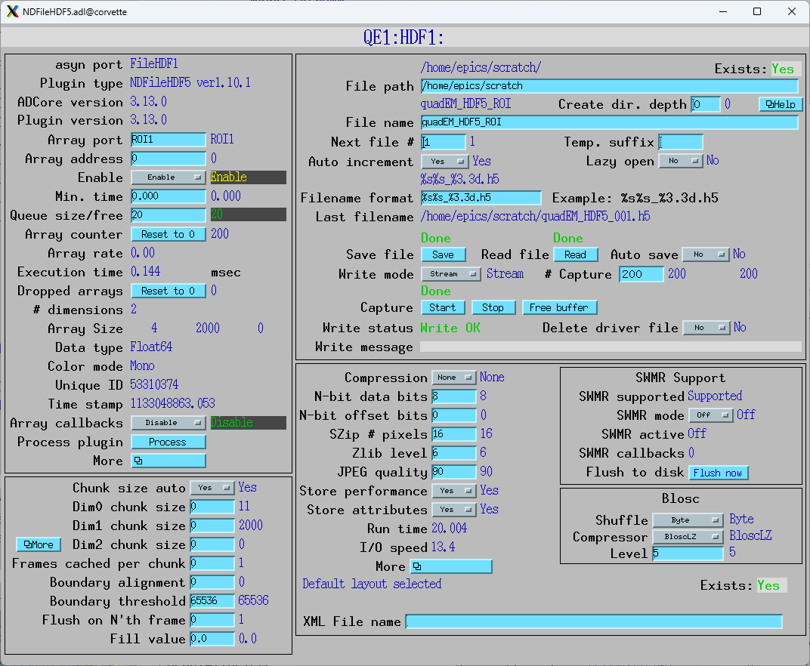
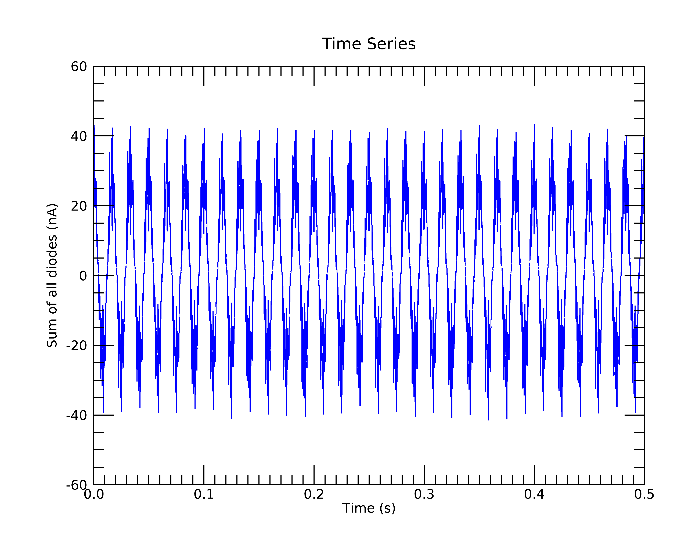

Streaming data to disk
----------------------

The example IOCs in quadEM load the file ADCore/iocBoot/commonPlugins.cmd.
This provides all the standard file plugins, including HDF5, netCDF, and TIFF.
These can be used to stream the quadEM data to disk, with no limit on
the duration except for disk file size.

As explained in the Plugins section, the NDArray callbacks to plugins occur
each time NumAverage_RBV samples have been received from the device.
Callbacks on address 11 contain all the data items, and the NDArray
dimensions are [11, NumAverage_RBV] for each NDArray callback.

This is the medm screen for the HDF5 plugin used with the TetrAMM.
The TetrAMM is configured with ValuesPerRead=5, so it is sending data at 20 kHz. 
AveragingTime is set to 0.1 seconds, so NumAverage_RBV is 2000.

.. figure:: HDF5_stream.png
    :align: center

|

The Array address in the plugin is set to 11, so it is receiving all 11 data items.  
FileWriteMode is set to Stream, so it will stream the NDArrays to the HDF5 file
as they arrive.  NumCapture is set to 200, so it will collect 200 arrays, each with 
0.1 second of data giving a total of 20 seconds saved to disk.
Pressing the Start button starts the streaming.

The resulting file, quadEM_HDF5_001.h5, is 34 MB.

This is the result of the Linux h5dump --contents on that file
::

  (base) [epics@corvette scratch]$ h5dump --contents quadEM_HDF5_001.h5
  HDF5 "quadEM_HDF5_001.h5" {
  FILE_CONTENTS {
   group      /
   group      /entry
   group      /entry/data
   dataset    /entry/data/data
   group      /entry/instrument
   group      /entry/instrument/NDAttributes
   dataset    /entry/instrument/NDAttributes/NDArrayEpicsTSSec
   dataset    /entry/instrument/NDAttributes/NDArrayEpicsTSnSec
   dataset    /entry/instrument/NDAttributes/NDArrayTimeStamp
   dataset    /entry/instrument/NDAttributes/NDArrayUniqueId
   group      /entry/instrument/detector
   group      /entry/instrument/detector/NDAttributes
   dataset    /entry/instrument/detector/data -> /entry/data/data
   group      /entry/instrument/performance
   dataset    /entry/instrument/performance/timestamp
   }
  }

The streamed data is in dataset /entry/data/data.  
This is the output of h5dump --header, looking at just that dataset.
::

         DATASET "data" {
            DATATYPE  H5T_IEEE_F64LE
            DATASPACE  SIMPLE { ( 200, 2000, 11 ) / ( 200, 2000, 11 ) }
            ATTRIBUTE "NDArrayDimBinning" {
               DATATYPE  H5T_STD_I32LE
               DATASPACE  SIMPLE { ( 2 ) / ( 2 ) }
            }
            ATTRIBUTE "NDArrayDimOffset" {
               DATATYPE  H5T_STD_I32LE
               DATASPACE  SIMPLE { ( 2 ) / ( 2 ) }
            }
            ATTRIBUTE "NDArrayDimReverse" {
               DATATYPE  H5T_STD_I32LE
               DATASPACE  SIMPLE { ( 2 ) / ( 2 ) }
            }
            ATTRIBUTE "NDArrayNumDims" {
               DATATYPE  H5T_STD_I32LE
               DATASPACE  SCALAR
            }
            ATTRIBUTE "signal" {
               DATATYPE  H5T_STD_I32LE
               DATASPACE  SCALAR
            }
         }
      }

It is IEEE 64-bit little-endian, with dimensions [200,2000,11].
In HDF5 convention the last array index is the fastest varying.

Saving all 11 data items is somewhat wastefull, since everything else can be calculated from just
the 4 currents, which are the first 4 items in the arrays.
We can save disk space by only saving the currents by using an ROI plugin between the 
quadEM driver and the HDF5 plugin.

This is the medm screen for an ROI plugin which gets its data on address 11 from the TetrAMM port.
It is configured with a start of 0 and size of 4 on the first array dimension, and so will 
select only the 4 currents.  The second dimension is set to auto size = Yes, so it will automatically
select all elements in the second dimension, even if NumAverage_RBV changes.

.. figure:: ROI_stream.png
    :align: center

|

The HDF5 plugin is changed to have its array port be ROI1, and the array address to be 0.
Note that the NDArrays being received are now [4, 2000].

The filename is changed to quadEM_HDF5_ROI_001.h5.  The resulting file size is 13 MB.

The following is an IDL program to process the data in quadEM_HDF5_001.h5.
The program does the following:

- Reads the dataset /entry/data/data into a variable called ``data``.
- Displays information about ``data``.
- Reformats ``data`` from a 3-D array with dimensions [11, 2000, 200] to a 2-D array with dimensions [11, 400000].
- Extracts the SumAll data into a variable called ``sum_all``, which the 6'th column of ``data``.
- Compute a ``time`` array variable which is the time of each sample.  It is 400000 points with 50 microseconds per point.
- Plots the first 0.5 seconds (1000 points) of ``sum_all`` vs ``time``.
- Computes the absolute value of the FFT of the ``sum_all`` variable, which is the power spectrum.
- Sets the first element (0 frequency, i.e. DC offset) to 0.
- Computes the frequency acis, which is 200000 points going from 0 to the Nyquist freqency of 10 kHz.
- Plots the power spectrum vs frequency.  Plots only the first 20000 points, which is 0 to 1 kHz, on a vertical log scale.

This is the IDL code:

.. code-block:: idl

  ; Program to read HDF5 file for streamed quadEM data, plot it
  data = h5_getdata('J:\epics\scratch\quadEM_HDF5_001.h5', '/entry/data/data')
  help, data
  ; Convert from a 3-D array [11, 2000, 200] to a 2-D array [11, 400000]
  data = reform(data, 11, 400000)
  ; Extract the SumAll data
  sum_all = data[6, *]
  ; Compute the time axis, 50 microseconds/sample
  time = findgen(400000) * 50e-6
  ; Plot the first 0.5 second of data
  p1 = plot(time[0:9999], sum_all[0:9999], xtitle='Time (s)', ytitle='Sum of all diodes (nA)', $
            title='Time Series', color='blue')
  p1.save, 'IDL_HDF5_time_plot.png'
  ; Compute the FFT
  f = fft(sum_all)
  ; Take the absolute value, first half of array
  f_abs = (abs(f))[0:199999]
  ; Set the DC offset to 0
  f_abs[0] = 0
  ; Compute the frequency axis. The sampling rate is 20 kHz so the Nyquist frequency is 10 kHz
  freq = findgen(200000)/199999. * 10000.
  ; Plot the data out to 1 kHz
  p2 = plot(freq[0:19999], f_abs[0:199999], xtitle='Frequency (Hz)', ytitle='SumAll Intensity', $
            title='Power Spectrum', color='red', /ylog, yrange=[.01,100])
  p2.save, 'IDL_HDF5_frequency_plot.png'
  end

This is the output when the program is compiled and run:

.. code-block:: idl

  IDL> .compile -v 'C:\Scratch\plot_quadem.pro'
  IDL> .go
  DATA            DOUBLE    = Array[11, 2000, 200]

This is the time-series plot.  The data are highly periodic because the photodiodes were illuminated 
by fluorescent lights.

|

This is the frequency plot.  The frequency peaks are almost exclusively 60 Hz and its odd and even harmonics.
The odd harmonics are ~10-100 times less than 60Hz, and the even harmonics are ~100-1000 times less than 60 Hz.

.. figure:: IDL_HDF5_frequency_plot.png
    :align: center
