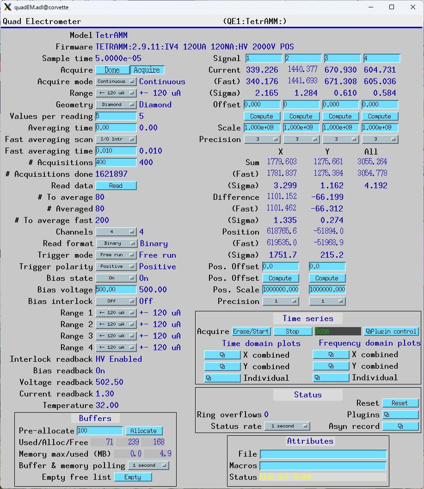
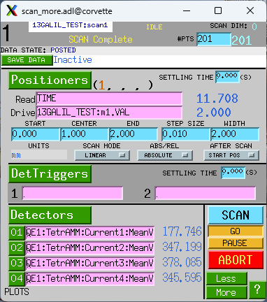
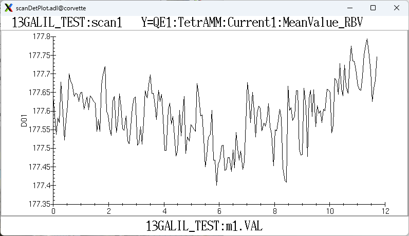
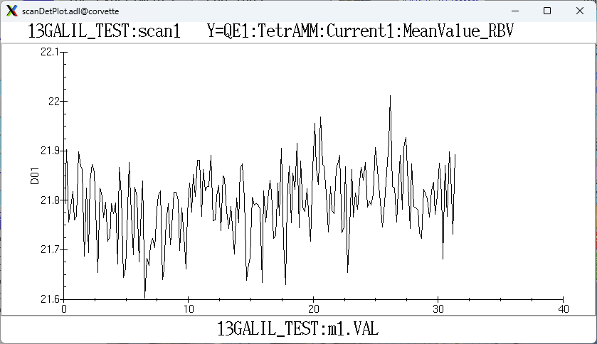
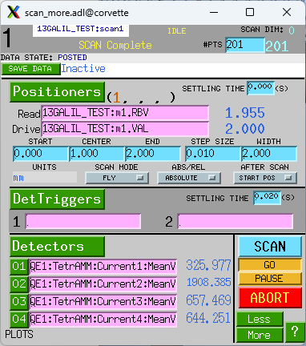
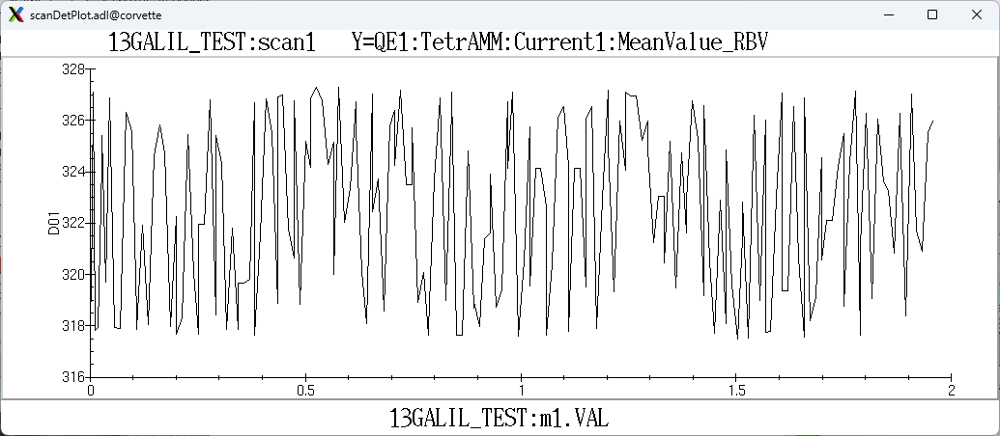
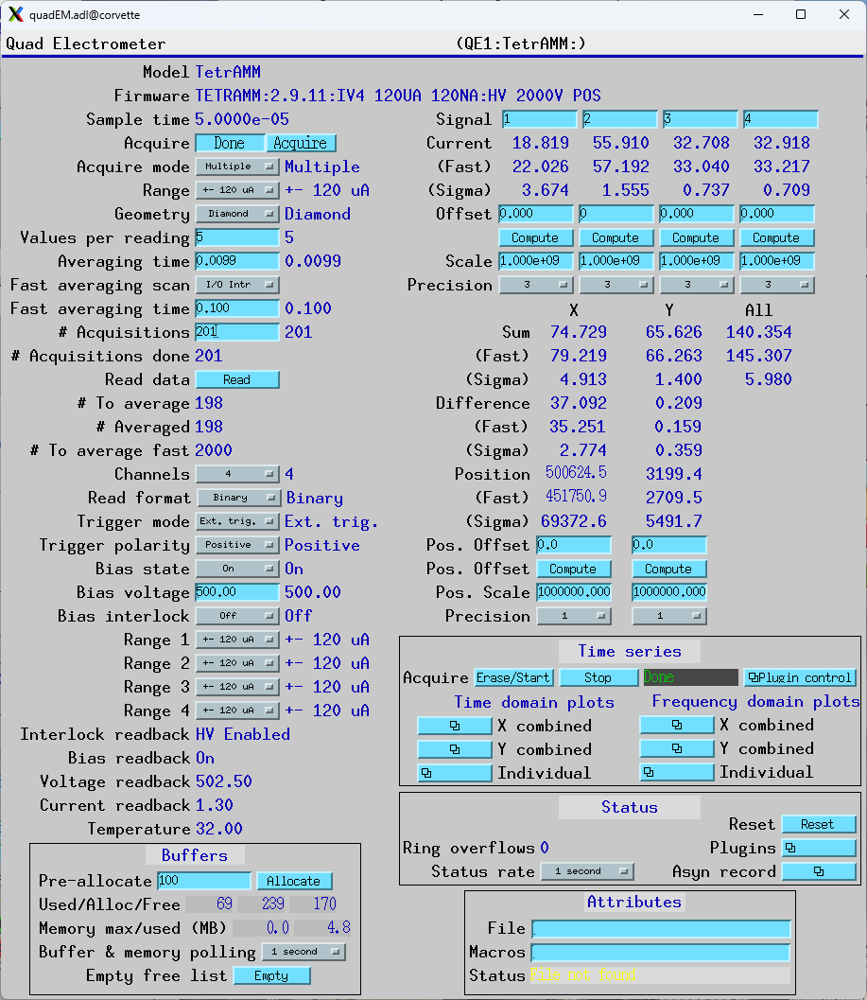
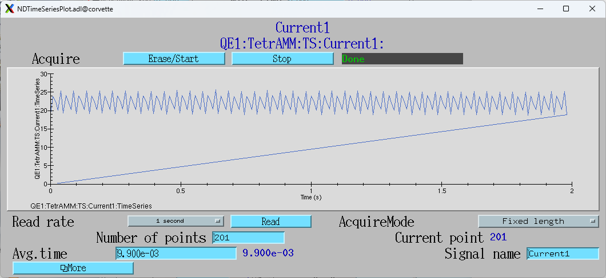

Scanning with the TetrAMM
~~~~~~~~~~~~~~~~~~~~~~~~~

With the above modes it is possible to use the TetrAMM for data acquisition during various types of scans.

The following is screen shot of the TetrAMM screen in the free-running continuous aquisition state with 0.01 second averaging time.
Each scan described below used most of these settings, with the changes in the settings described for that scan type.

Step scan with TetrAMM in free-run mode
.......................................
This scan type uses a step-scan for the positioner and runs the TetrAMM in free running mode.
The TetrAMM averaging time is set a small amount less than the time it takes the motors to move
each step.  This mode is faster than stopping and starting the TetrAMM at each point. The errord
due to the TetrAMM not being strictly synchronized to the motor position are likely to be acceptable
in many cases.

The following is screen shot of the sscan record moving a single motor and reading the 4 currents from the TetrAMM.
There is no detector trigger.

The scan is 201 points and took 11.7 seconds.  The time per point is thus 0.058 ms.  

The TetrAMM was configured as follows:

- AcquireMode=Continuous
- ValuesPerRead=5
- AveragingTime=.05 s.  This is a little less than the time per point in the scan, so there will be a new reading at each point.
- The sscan record detectors are Current1:MeanValue_RBV, Current2:MeanValue_RBV, etc.

This is a plot of Current1 after the scan.

|

Step scan with TetrAMM in single acquire mode
.............................................
This scan type uses a step-scan for the positioner and runs the TetrAMM in single cycle mode.
This guarantees that the TetrAMM was only counting when the motor was at the target position
for each step.

The following is screen shot of the sscan record moving a single motor and reading the 4 currents from the TetrAMM.
The detector trigger is the TetrAMM Acquire PV.

.. figure:: sscan_tetramm_triggered.png
    :align: center

The scan is 201 points and took 31.3 seconds.
This scan took 20 seconds longer than the scan where the TetrAMM AcquireMode is Continuous. 
10 seconds of this are because the scan needs to wait for the TetrAMM averaging for 50 ms at each point.
The additional 10 seconds is due to overhead with restarting the TetrAMM at each point.

The TetrAMM was configured as follows:

- AcquireMode=Single
- ValuesPerRead=50
- AveragingTime=.05 s

This is a plot of Current1 after the scan.

|

Fly scan with TetrAMM in free-run mode
.............................................
This scan type uses a fly-scan for the positioner and runs the TetrAMM in free-run continuous mode.
The scan is configured by setting the following:

- The total time for the scan is controlled by the number of points (.NPTS) and the detector settling time (.DDLY). 
  Currently the actual detector settling time on Linux is 5 ms less than the requested value, due to some timer granularity
  in EPICS base. The minimum requested time is 10 ms, which means that the minimum actual time is 5 ms.
  In the example below .DDLY=.02 s, so the actual delay is .015 seconds.  This means that the 201 point scan will
  complete in 3.0 seconds.
- The motor speed must be set to so that it will reach the end position in the total time for the scan.
  In this case the motor travel is set to 2 mm, and hence the velocity is set to 0.667 so it will complete
  the move in 3.0 seconds.  This neglects the acceleration and deceleration times, which are 0.2 seconds.
- In Fly mode the sscan record starts the motor moving continuously to the final position.  While the motor
  is moving the sscan record records the motor readback position and the detector values continuously, with
  a delay of .DDLY.  This means that the detector values and motor positions recorded are synchronized within the
  accuracy and precision of their respective update rates.

The following is screen shot of the sscan record moving a single motor continuously and reading the 4 currents from the TetrAMM.

The scan is 201 points and took 3.05 seconds as shown on the readback for the second positioner = TIME.

.. figure:: sscan_tetramm_fly_free_run_positioners.png
    :align: center

The TetrAMM was configured as follows:

- AcquireMode=Continuous
- TriggerMode=Free run
- ValuesPerRead=5
- AveragingTime=.01 s

This is a plot of Current1 after the scan.

|

Triggered scan using TetrAMM time series plugin
...............................................
This scan type uses triggers from the positioner to collect the TetrAMM data in the NDPluginTimeSeries plugin.
This guarantees that the positioner and detector data are perfectly synchronized.

For this test the triggers came from a Measurement Computing USB-CTR08 pulse generator, but they could
have been coming from position based triggers from an XPS or Galil motor controller.

The scan is configured by first determining the period at which trigger pulses will be arriving. 
For a motor scan this will be calculated from the distance interval per trigger and the motor velocity. 
For this test it was set by the following:

- The pulse generator is configured to output 201 pulses at 100 Hz, i.e. .01 second period.

The TetrAMM was configured as follows:

- AcquireMode=Multiple
- NumAcquire=201
- TriggerMode=Ext. Trig.
- ValuesPerRead=5
- AveragingTime=.0099 s, 1% (0.1 ms) less than the trigger period.

This is the configuration of the TetrAMM in this mode.

When TriggerMode=Ext. Trig. the driver tells the TetrAMM to collect the number of samples determined by the
AveragingTime (i.e. NumAverage_RBV) on receipt of each trigger pulse.  NumAverage_RBV is 198 in the example above.
The AveragingTime must be slightly less than the trigger pulse period to allow for slight clock frequency differences
between the trigger source and the TetrAMM.  In this case the AveragingTime is 1% (0.1 ms) less than the pulse period.
The only consequence of this is that there is 1% during each acquire period (0.1 ms) when the TetrAMM is not collecting data.

The TetrAMM TimeSeries plugin is configured as follows:

- AveragingTime=0.0099 s
- NumPoints=201

This is the configuration of the TimeSeries plugin:

.. figure:: tetramm_fly_triggered_time_series.png
    :align: center

The AveragingTime of the time series plugin must be the same as that for the TetrAMM.  This guarantees that each
external trigger will move to the next point in the time series.

The following steps are used to perform as scan in this mode:

- Set the TimeSeries TSAcquire (labeled Erase/Start) PV to 1
- Set the TetrAMM Acquire PV to 1
- Start the trigger source.  In this test that is the pulse generator, but it would normally be the motor 
  generating the trigger pulses.
- Wait for the motion to complete and then read the time series waveform records, e.g. TS:Current1, etc.

This is a plot of Current1 after the scan.  The retrace to 0 on the last point is a bug in medm.

Note while the scan actually took 2.01 seconds (201 points at 100 Hz) the last point horizontal scale
of this plot is 1.98 seconds.  
This is because the time between triggers is 1% more than the averaging time, but the 
plugin has no way to know what the actual time between trigger pulses is. 
 